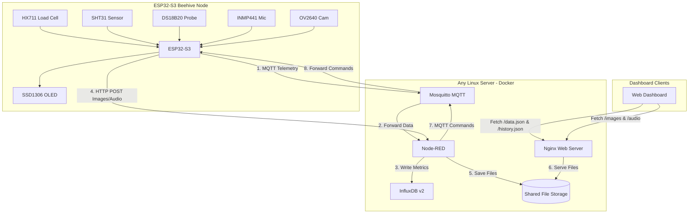

# SmartBeehive Monitoring System

This project is an IoT-based beehive monitoring system. An ESP32-S3 collects real-time beehive data (weight, temperature, audio, and images) and sends it over Wi-Fi to a central STM32MP215F-DK Linux server running Docker.


## System Architecture



## Hardware Components

### Edge Node
* ESP32-S3 development board
* OV2640 Camera
* INMP441 I2S Microphone
* HX711 ADC & Load Cell
* SHT31-D Temp & Humidity Sensor
* DS18B20 Temp Probe
* SSD1306 OLED Display

### Server Host
* **STM32MP215F-DK** (or any device running Linux like Raspberry Pi, PC, or VPS)

## Pinout Mapping (ESP32-S3)

| Component / Signal | ESP32-S3 Pin |
| :--- | :--- |
| **HX711 DOUT** | GPIO 1 |
| **HX711 SCK** | GPIO 2 |
| **I2C SDA** (SHT31 & OLED) | GPIO 21 |
| **I2C SCL** (SHT31 & OLED) | GPIO 38 |
| **DS18B20 Data** | GPIO 14 |
| **INMP441 I2S WS** | GPIO 39 |
| **INMP441 I2S SCK** | GPIO 40 |
| **INMP441 I2S SD** | GPIO 41 |
| **OV2640 Camera** | Standard DVP pinout |

## Server Deployment

To deploy the entire server stack (Mosquitto, Node-RED, InfluxDB, Nginx) on your Linux host using the provided `server/docker-compose.yml`:

```bash
# Start the stack in background (detached mode)
docker-compose up -d

# Verify that all 4 containers are successfully running
docker ps
```

## Edge Node Build Guide

### Configure Credentials
Update the configuration section at the top of the main source file:

```c
#define WIFI_SSID           "Your_SSID"
#define WIFI_PASS           "Your_Password"
#define SERVER_IP           "Your_Server_IP"
```

### Compile and Flash
Execute the following commands in your ESP-IDF terminal environment:

```bash
idf.py set-target esp32s3

idf.py build

idf.py flash
```
